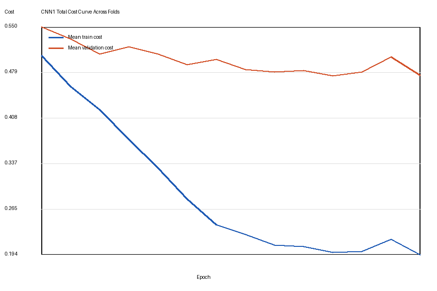
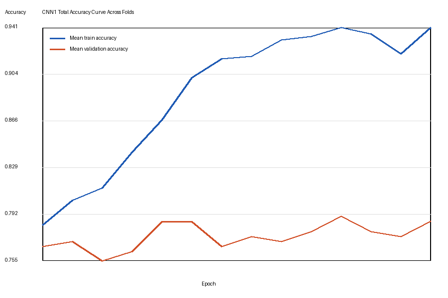
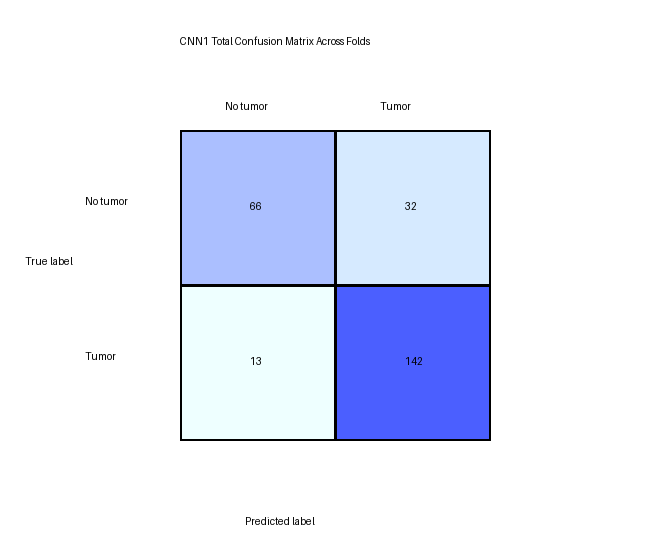

# CNN3Way Brain MRI Classification

> [!SUMMARY]
> A from-scratch NumPy deep learning project for binary brain MRI tumor classification. The current implementation contains the completed CNN Base model, with InceptionNet and ResNet planned as the next two architectures for comparison.

## Project Snapshot

| Field | Details |
|---|---|
| Task | Brain MRI tumor detection |
| Type | Binary image classification |
| Classes | `tumor` and `no tumor` |
| Current model | CNN Base |
| Planned models | InceptionNet, ResNet |
| Framework | NumPy from scratch |
| Dataset size used | 253 images |
| Validation method | Stratified 5-fold cross-validation |
| Main runner | `main_cnn1.py` |

> [!IMPORTANT]
> This project is for learning, experimentation, and academic demonstration. It is not a medical diagnostic system.

## Table of Contents

- [Project Goal](#project-goal)
- [Current Repository State](#current-repository-state)
- [Dataset Layout](#dataset-layout)
- [Installation](#installation)
- [How To Run](#how-to-run)
- [CNN Base Architecture](#cnn-base-architecture)
- [How The CNN Works](#how-the-cnn-works)
- [Training Strategy](#training-strategy)
- [Latest CNN1 Results](#latest-cnn1-results)
- [Result Visualizations](#result-visualizations)
- [Output Files](#output-files)
- [Code Structure](#code-structure)
- [Prediction With Saved Parameters](#prediction-with-saved-parameters)
- [Limitations](#limitations)
- [Next Steps](#next-steps)

## Project Goal

The project is designed to compare three convolutional neural network architectures on the same or similar brain MRI dataset:

1. CNN Base
2. InceptionNet
3. ResNet

The first architecture, CNN Base, is already implemented from scratch using NumPy. The next stages will extend the project with InceptionNet-style and ResNet-style models while reusing the same data pipeline, training loop, metric calculations, and output structure.

## Current Repository State

Implemented:

- MRI image loading and preprocessing
- Binary labels for tumor and no-tumor classes
- CNN Base model from scratch
- Manual convolution, max-pooling, dense layers, activations, and backpropagation
- Dropout and L2 regularization
- Adam optimizer from scratch
- Stratified k-fold cross-validation
- Dynamic early stopping per fold
- Accuracy, precision, recall, F1, and confusion matrix metrics
- Per-fold and total plots
- Best-fold parameter saving for later prediction

Planned:

- InceptionNet implementation from scratch
- ResNet implementation from scratch
- Architecture-level comparison using the same evaluation policy
- Single-image prediction script

## Dataset Layout

The dataset is intentionally not committed to GitHub. Place it locally like this:

```text
data/
  yes/
    tumor MRI images
  no/
    no-tumor MRI images
```

Class mapping:

```text
yes -> 1
no  -> 0
```

Supported image formats:

```text
.jpg, .jpeg, .png, .bmp, .webp
```

Latest recorded local dataset:

| Class | Count |
|---|---:|
| Tumor | 155 |
| No tumor | 98 |
| Total | 253 |

Each image is:

1. Loaded with Pillow
2. Converted to grayscale
3. Resized to `64 x 64`
4. Normalized to `[0, 1]`
5. Stored as `(64, 64, 1)`

Final data tensors:

```text
X: (253, 64, 64, 1)
Y: (253, 1)
```

## Installation

Install dependencies with:

```bash
pip install -r requirements.txt
```

Dependencies:

```text
numpy
Pillow
matplotlib
```

> [!NOTE]
> If `matplotlib` is unavailable, `main_cnn1.py` includes a Pillow-based fallback that still saves basic plot images.

## How To Run

Run the CNN Base experiment:

```bash
python main_cnn1.py
```

The terminal prints live progress:

```text
Epoch 1/20 [##############################] 26/26 | batch cost: ... | lr: ...
Fold 1 | Epoch 1/20 summary
Train cost: ... | Val cost: ...
Train acc: ... | Val acc: ...
Train F1: ... | Val F1: ...
```

## CNN Base Architecture

Current architecture:

```text
Input: 64 x 64 x 1

Conv1 -> ReLU -> MaxPool
Conv2 -> ReLU -> Dropout -> MaxPool
Flatten
Dense 64 -> ReLU -> Dropout
Dense 1 -> Sigmoid
```

Shape flow:

| Stage | Operation | Output shape |
|---|---|---|
| Input | Grayscale MRI | `64 x 64 x 1` |
| Conv1 | 8 filters, `3 x 3`, stride 1, pad 1 | `64 x 64 x 8` |
| ReLU | Non-linearity | `64 x 64 x 8` |
| MaxPool1 | `2 x 2`, stride 2 | `32 x 32 x 8` |
| Conv2 | 16 filters, `3 x 3`, stride 1, pad 1 | `32 x 32 x 16` |
| ReLU | Non-linearity | `32 x 32 x 16` |
| Dropout | `conv_keep_prob = 0.85` | `32 x 32 x 16` |
| MaxPool2 | `2 x 2`, stride 2 | `16 x 16 x 16` |
| Flatten | Vectorization | `4096` |
| Dense hidden | `4096 -> 64` | `64` |
| ReLU | Non-linearity | `64` |
| Dropout | `dense_keep_prob = 0.75` | `64` |
| Dense output | `64 -> 1` | `1` |
| Sigmoid | Probability | `1` |

Prediction rule:

```text
probability >= 0.5 -> tumor
probability < 0.5  -> no tumor
```

## How The CNN Works

### 1. Convolution Layers

The convolution layers scan small filters over the MRI image. Early filters learn simple spatial patterns such as edges, boundaries, bright spots, dark regions, and local texture changes.

The first convolution layer receives a single grayscale channel and produces 8 feature maps:

```text
64 x 64 x 1 -> 64 x 64 x 8
```

The second convolution layer takes those learned feature maps and produces 16 deeper feature maps:

```text
32 x 32 x 8 -> 32 x 32 x 16
```

### 2. ReLU Activation

ReLU is applied after convolution and dense hidden layers:

```text
ReLU(x) = max(0, x)
```

This introduces non-linearity and helps the model learn more complex patterns than a purely linear model could represent.

### 3. Max-Pooling

Max-pooling reduces spatial size while preserving the strongest local activations:

```text
64 x 64 -> 32 x 32
32 x 32 -> 16 x 16
```

This lowers computation and helps the model become less sensitive to tiny shifts in image position.

### 4. Dropout

Dropout randomly disables some activations during training.

Current dropout values:

```text
conv_keep_prob = 0.85
dense_keep_prob = 0.75
```

This means:

- About 15 percent of selected convolution features are dropped during training
- About 25 percent of hidden dense activations are dropped during training

Dropout is disabled during validation and prediction.

### 5. Flattening

After the second pooling layer, the tensor is:

```text
16 x 16 x 16
```

This becomes:

```text
4096 features
```

### 6. Dense Classifier

The original CNN Base connected the flattened vector directly to the sigmoid output:

```text
4096 -> 1
```

That was too broad and encouraged overfitting. The updated classifier head is:

```text
4096 -> 64 -> 1
```

Current dense parameter shapes:

```text
W3: 4096 x 64
b3: 1 x 64
W4: 64 x 1
b4: 1 x 1
```

### 7. Sigmoid Output

The final sigmoid converts the output into a probability:

```text
sigmoid(z) = 1 / (1 + e^-z)
```

The probability is interpreted as the likelihood of the MRI belonging to the tumor class.

## Training Strategy

### Loss Function

The model uses binary cross-entropy:

```text
Loss = -[y log(a) + (1 - y) log(1 - a)]
```

where:

```text
y = true label
a = predicted probability
```

### L2 Regularization

L2 regularization penalizes large weights:

```text
lambda = 0.005
```

This helps reduce overfitting.

### Optimizer

Adam optimizer is implemented manually in NumPy.

Current values:

```text
beta1 = 0.9
beta2 = 0.999
epsilon = 1e-8
```

### Learning Rate Decay

The learning rate decays with:

```text
lr = initial_lr / (1 + decay_rate * epoch)
```

Current settings:

```text
initial_learning_rate = 0.001
decay_rate = 0.02
```

### Stratified 5-Fold Cross-Validation

The dataset is split into 5 folds while preserving class balance. Each fold trains on about 80 percent of the dataset and validates on the remaining 20 percent.

### Dynamic Early Stopping

Each fold can train up to 20 epochs, but stops earlier when validation performance stops improving or overfitting becomes too strong.

Current settings:

```text
max epochs = 20
min_epochs = 5
patience = 3
min_delta = 0.001
overfit_gap = 0.08
overfit_patience = 2
```

Overfitting guard:

```text
train F1 - validation F1 >= 0.08
```

and validation cost is worse than the best epoch for 2 consecutive epochs.

At the end of each fold, the best epoch's parameters are restored before final validation metrics are calculated.

## Latest CNN1 Results

5-fold mean metrics:

| Metric | Value |
|---|---:|
| Mean accuracy | 0.8225 |
| Mean precision | 0.8189 |
| Mean recall | 0.9161 |
| Mean F1 | 0.8632 |

Total validation metrics:

| Metric | Value |
|---|---:|
| Accuracy | 0.8221 |
| Precision | 0.8161 |
| Recall | 0.9161 |
| F1 | 0.8632 |

Total confusion matrix:

```text
[[ 66  32]
 [ 13 142]]
```

Matrix format:

```text
[[TN FP]
 [FN TP]]
```

Interpretation:

| Value | Meaning | Count |
|---|---|---:|
| TN | No-tumor correctly predicted as no-tumor | 66 |
| FP | No-tumor incorrectly predicted as tumor | 32 |
| FN | Tumor incorrectly predicted as no-tumor | 13 |
| TP | Tumor correctly predicted as tumor | 142 |

The model has high recall, which means it catches most tumor cases. It still has a noticeable number of false positives, so it tends to predict tumor in some uncertain no-tumor cases.

Best fold:

| Metric | Fold 5 |
|---|---:|
| Accuracy | 0.9200 |
| Precision | 0.9091 |
| Recall | 0.9677 |
| F1 | 0.9375 |

## Result Visualizations

### Total Cost Curve



The training cost decreases steadily, while validation cost remains higher and fluctuates. This shows that the model learns the training data strongly, and early stopping is important to avoid uncontrolled overfitting.

### Total Accuracy Curve



Training accuracy rises sharply, while validation accuracy improves more slowly and remains less stable. This is expected with a small dataset and confirms why fold-level early stopping is useful.

### Total Confusion Matrix



The confusion matrix shows strong tumor detection recall, with 142 true positives and 13 false negatives across all validation folds.

## Output Files

Metrics:

```text
results/cnn1/metrics/cnn1_kfold_summary.json
```

Saved best-fold parameters:

```text
results/cnn1/metrics/updated_parameters_1.json
```

This file is generated locally after training and ignored by Git because it can become large.

Per-fold plots:

```text
results/cnn1/plots/cnn1_fold_1_accuracy_curve.png
results/cnn1/plots/cnn1_fold_1_cost_curve.png
results/cnn1/plots/cnn1_fold_1_confusion_matrix.png
...
```

Total plots:

```text
results/cnn1/plots/cnn1_total_accuracy_curve.png
results/cnn1/plots/cnn1_total_cost_curve.png
results/cnn1/plots/cnn1_total_confusion_matrix.png
```

Report-friendly JPG outputs:

```text
Output/CNN1Accuracy.jpg
Output/CNN1Cost.jpg
Output/CNN1ConfMatrix.jpg
```

## Code Structure

### `data.py`

Handles dataset loading and splitting.

Responsibilities:

- Load image files from `data/yes` and `data/no`
- Resize images to `64 x 64`
- Convert images to grayscale
- Normalize pixel values to `[0, 1]`
- Create binary labels
- Shuffle data
- Create stratified k-fold splits

Important functions:

```text
load_image_as_array()
get_image_paths()
load_brain_mri_dataset()
create_stratified_k_folds()
load_brain_mri_kfold_data()
```

### `operations.py`

Contains the low-level neural network math.

Responsibilities:

- Zero padding
- Convolution forward and backward pass
- Max-pooling forward and backward pass
- Dense layer forward and backward pass
- ReLU and sigmoid activations
- Flatten operation

Important functions:

```text
zero_pad()
relu()
sigmoid()
conv_forward()
max_pool_forward()
flatten()
dense_forward()
relu_backward()
dense_backward()
conv_backward()
max_pool_backward()
```

### `cnn1_core.py`

Defines the CNN Base model.

Responsibilities:

- Initialize CNN parameters
- Run forward propagation
- Apply dropout
- Compute binary cross-entropy cost
- Add L2 regularization
- Run backpropagation
- Run Adam parameter updates
- Predict labels and probabilities
- Load saved parameter JSON

Important functions:

```text
initialize_cnn1_parameters()
cnn1_forward()
compute_cost()
cnn1_backward()
initialize_adam()
adam_update()
predict_cnn1()
load_cnn1_parameters_from_json()
```

### `cnn1_train.py`

Contains reusable training helpers outside the full k-fold experiment.

Responsibilities:

- Create mini-batches
- Apply learning rate decay
- Train CNN1 on a normal train/validation split
- Evaluate CNN1 on test data

Important functions:

```text
create_mini_batches()
learning_rate_decay()
accuracy()
train_cnn1()
evaluate_cnn1()
```

### `main_cnn1.py`

Main experiment runner.

Responsibilities:

- Create output folders
- Load dataset
- Build stratified folds
- Train each fold
- Print progress bars
- Apply dynamic early stopping
- Restore best fold parameters
- Compute metrics
- Save plots
- Save summary JSON
- Save best-fold parameters

Important functions:

```text
run_cnn1_experiment()
train_one_fold()
classification_metrics()
summarize_kfold_metrics()
summarize_total_metrics()
save_experiment_summary()
save_updated_parameters()
```

## Prediction With Saved Parameters

After training, load the best-fold saved weights:

```python
from cnn1_core import load_cnn1_parameters_from_json, predict_cnn1

parameters = load_cnn1_parameters_from_json(
    "results/cnn1/metrics/updated_parameters_1.json"
)

predictions, probabilities = predict_cnn1(X_new, parameters)
```

`X_new` must be preprocessed the same way as training images:

```text
(m, 64, 64, 1)
```

with pixel values normalized to `[0, 1]`.

## Repository Notes

The repository ignores local dataset files and large generated parameter files:

```text
data/
archive.zip
*.zip
results/cnn1/metrics/updated_parameters_*.json
__pycache__/
```

This keeps the repository lightweight and focused on source code, result summaries, and plots.

## Limitations

- The model is written from scratch, so training is much slower than PyTorch or TensorFlow.
- The dataset is small.
- The dataset is class-imbalanced.
- The current model has high recall but still produces false positives.
- Only CNN Base is implemented so far.

## Next Steps

- Implement InceptionNet from scratch using NumPy
- Implement ResNet from scratch using NumPy
- Compare all three architectures using the same folds and metrics
- Add a single-image prediction script
- Add model comparison tables
- Add dataset source details
- Add project report references
